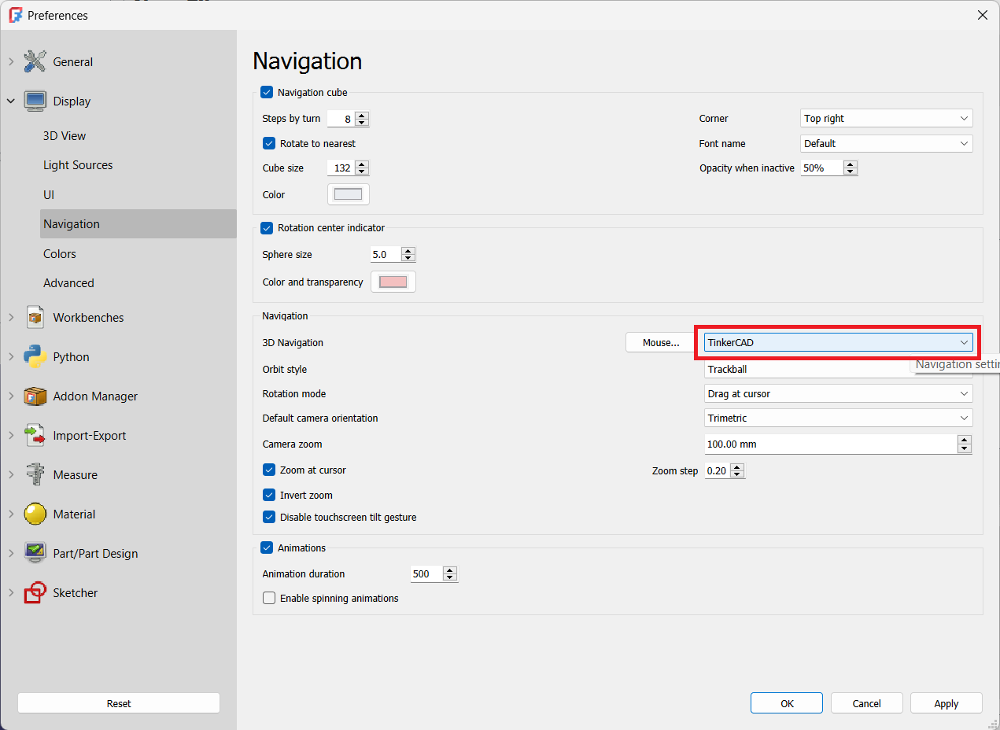
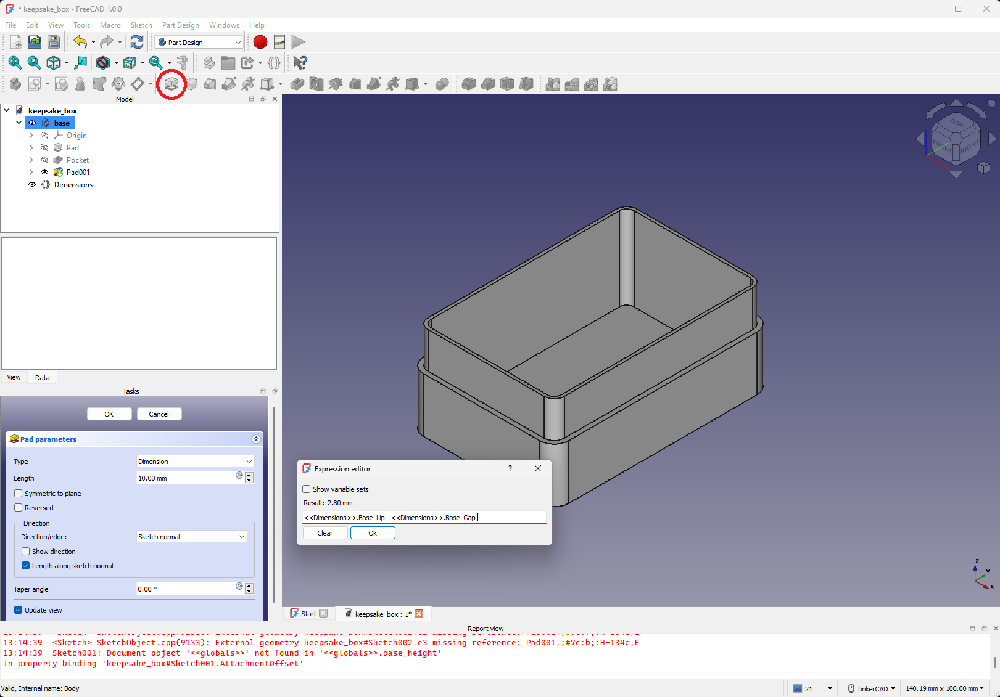
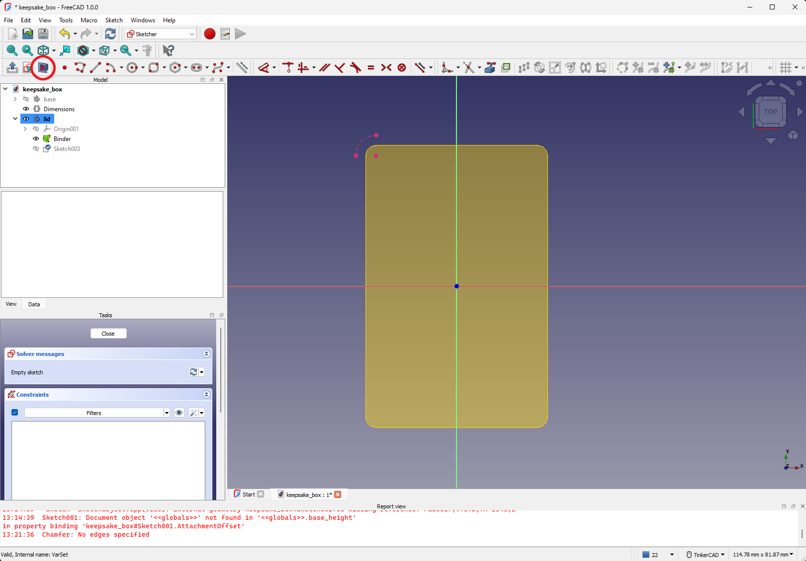
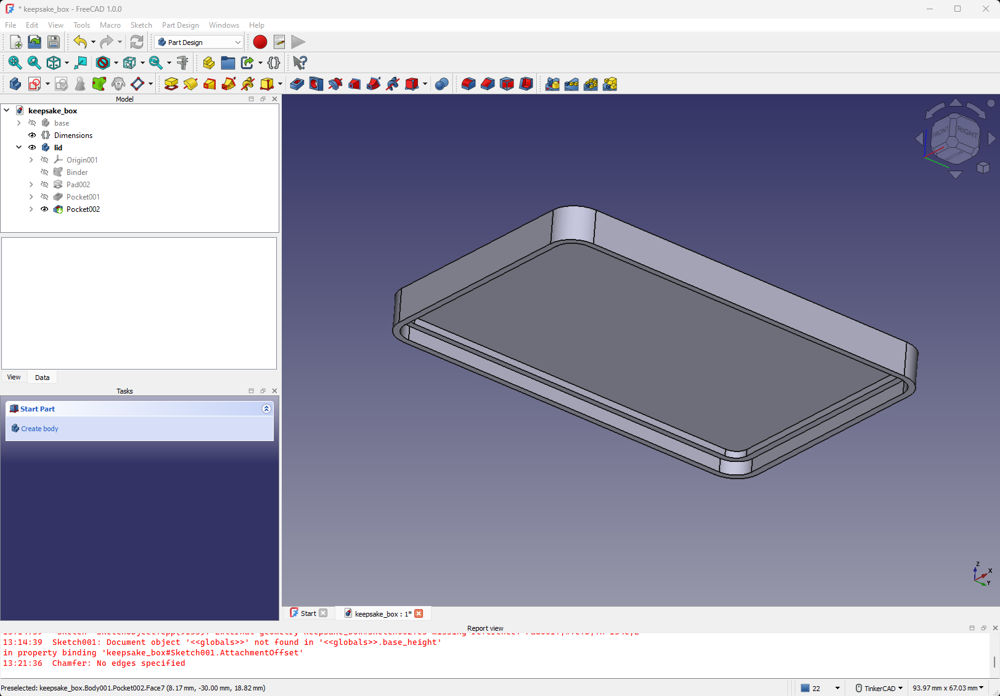

In this workshop, we create a simple two-part box (base and lid) using FreeCAD. If you have never used FreeCAD before, this is a great place to start!

 * **Audience**: Beginners
 * **Estimated time**: 2 hours

## Table of Contents

- [Finished Design](#finished-design)
- [Tutorial](#tutorial)
   * [1. Installation and Configuration](#1-installation-and-configuration)
   * [2. Part Design Workbench and Navigation](#2-part-design-workbench-and-navigation)
   * [3. Variable Set (VarSet)](#3-variable-set-varset)
   * [4. Base Sketch](#4-base-sketch)
   * [5. Create the Base](#5-create-the-base)
   * [6. Create the Lip](#6-create-the-lip)
   * [7. Add a Chamfer to the Base](#7-add-a-chamfer-to-the-base)
   * [8. Using a Sub-Shape Binder as Reference to Make the Lid](#8-using-a-sub-shape-binder-as-reference-to-make-the-lid)
   * [9. Move Sketch and Create Lid Extrusion](#9-move-sketch-and-create-lid-extrusion)
   * [10. Challenge: Finish the Lid](#10-challenge-finish-the-lid)
   * [11. Adjusting Global Variables](#11-adjusting-global-variables)
   * [12. Export for 3D Printing](#12-export-for-3d-printing)
- [License](#license)

## Finished Design

When you are done, you are welcome to 3D print the design.

Want to go beyond this workshop? Check out my full [Introduction to 3D Printing and FreeCAD series](https://www.youtube.com/watch?v=rbe8otH8vMs&list=PLEBQazB0HUyTQkRkbD02DZqnlV6oBMhHB&index=1).

## Tutorial

### 1. Installation and Configuration

Head to [freecad.org](https://www.freecad.org/) to download the latest version of FreeCAD.

> **Important!** This tutorial was made with **FreeCAD v1.0.0**. Features change between versions--if you cannot find something in your FreeCAD, check the version. You may need to downgrade if you want all buttons, fields, etc. to be in the same place as my screenshots.

Run the installer for your OS.

Open FreeCAD, and click **Edit > Preferences...** In the navigation pane on the left, go to **Display > Navigation**. For the *3D Navigation* setting, select **TinkerCAD**.

> *Note*: I personally found the TinkerCAD navigation to be the most intuitive (i.e. it matched my Cura slicer navigation style). Feel free to try other navigation schemes to find one you like. Any navigation instructions given in this guide will be based on the TinkerCAD navigation style.

### 2. Part Design Workbench and Navigation

When you first opened FreeCAD, you probably noticed a number of buttons at the top. These determine what actions you can take within a given *workbench*. A *workbench* is a collection of tools, buttons, views, etc. that allow you to act upon some object or document. Think of workbenches just like workbenches in a machine shop: each has its own uses and tools.

You can click the **workbench drop-down** to select which workbench you'd like to use. By default, FreeCAD recommends the *Part Design* workbench. *Part Design* allows you to build up and carve out in a linear set of steps (e.g. by making sketches and then padding/extruding or pocketing/cutting). If you've worked with other modern CAD tools, like SolidWorks, Onshape, or Fusion, this will be a very familiar workflow.

> Note that changing the workbench changes the buttons, tools, menu items, and views!

*Part*, on the other hand, is an older workbench that allows you to create 3D objects by adding and subtracting simple shapes (e.g. cubes, spheres). If you've worked with CAD programs like Tinkercad, this workflow will be familiar.

We will work mainly in the *Part Design* and *Sketcher* workbenches in this tutorial. *Sketcher*, as the name implies, allows you to make fully parametric (i.e. defining shapes through the use of parameters and relationships) sketches. Other workbenches exist for more advanced functionality (e.g. finite element analysis, CAM for manufacturing).

 * Select the **Part Design** workbench (if not already selected)
 * Click **File > New** to create a new document
 * Select the document (named **Unnamed**) in the *tree view* pane on the top-left
 * Click the **Create body** button to create a new *Body* in the document

A *Body* is a single, contiguous object in the *Part Design* workbench. You add sketches, extrude ("pad") and cut ("pocket") in a body to make your object. Note that *Body* must be a single (contiguous) object--you cannot have disconnected parts in the same *Body*! If you try to do this, FreeCAD will throw an error. As you'll see, you can have multiple bodies in the same document!

 * Click on **Origin** under your *Body* in the *tree view*. Press the **spacebar** to toggle its visibility.
   * You should see axes and planes appear in the main 3D view
 * Right-click and hold in the main 3D view, drag your mouse around to adjust the viewing angle
   * A red dot appears to show you where you clicked (the camera rotates relative to that point)

 * Middle-click and hold in the main 3D view, drag your mouse around to pan the view
 * You can also left-click on objects, faces, lines, points, etc. in the 3D view to select them

> This navigation style is the *TinkerCAD* scheme we set in the Preferences window earlier. You are welcome to change the style if it is not to your liking.

 * Click **File > Save** to save your document, which will rename it in the tree view (e.g. "box")
 * Right-click on the **Body** in the tree view, click **rename** and give the body the name "base" (as this will be the base of our box that mates with the lid)

### 3. Variable Set (VarSet)

The thing that makes *parametric* modeling unique (as opposed to *direct* modeling that you might find in e.g. Blender) is the ability to set parameters and relationships among your different design elements. For example, we can set a box length and width that can be adjusted long after we finish our design to easily scale our box! There are a number of ways to accomplish this in FreeCAD, such as sketch parameters or spreadsheets, but we'll use a *variable set*.

 * Click on your **box** document to select it

We want the VarSet to be placed under the *document* (and not the *body*) in the tree view. This will make the properties easier to access in future steps.

 * Click the **variable set** button (looks like curly braces **{ }** in your toolbar)
 * Click **Cancel** to ignore the pop-up window (notice that the VarSet is still created)

This process adds a value to the variable set. Note that we are using the type *PropertyLength* for all of these properties, as we're using them for various length (line, pad, pocket, etc.) dimensions. You can set other types if needed.

 * Click on **VarSet** in the tree view, which will open the variable set in the *properties editor* (just below the *tree view* pane)
 * Click on **VarSet** (the *Label*) and rename it to `Dimensions`
 * Right-click in the properties pane, select **Add property**
 * Set the *Name* to **Length**
 * Click **OK**

 * Click on the **0.00 mm** in the *Length* property value and change it to **60 mm**
 * Repeat this process to add the following properties:
   * BaseHeight: **15 mm**
   * Fillet: **4 mm**
   * Gap: **0.2 mm**
   * LidHeight: **5 mm**
   * Lip: **2 mm**
   * Wall: **2 mm**
   * Width: **40 mm**

We now have a full set of global variables (in our document) that we can use to adjust different dimensions in our design!

### 4. Base Sketch

We will create a sketch to define the bottom part of our box.

 * Click on the **sketch** button
 * Select the *XY Plane* (in the viewer or in the *task pane*)
 * Click **OK**

This will change to the *Sketch* workbench automatically and rotate your view so that you are looking down onto the XY plane.

 * Use the drop-down menu next to the *rectangle* button to select **Rounded rectangle**

 * Click the **Rounded rectangle* button
 * Click to in the viewer to place the first marker
 * Click in a quandrant opposite the origin to place the second marker
 * Move the mouse to adjust the size of the fillets, click a third time to set the fillet size
 * Note that the exact dimensions do not matter yet! We will add constraints next.
 * Press `esc` to exit the *Rounded rectangle* tool mode (the *Rounded rectangle* icon next to your mouse will disappear)

> Note: Try to make your rounded rectangle similar to the one shown below. By exiting the *Rounded rectangle* tool mode (with `esc`), you can click and drag lines, arcs, and points around to adjust the size/shape of the rounded rectangle. No need to be exact--you just want the arcs/corners in each quandrant around the origin. It will make the next part easier.

Notice the *Under-constrained* number under the *Solver messages* section in the *Task pane*. "5 DoF(s)" means "5 degrees of freedom." This is the number of possible movements in a part (or assembly) in a 3-dimensional space: X, Y, or Z. Because this a 2D sketch, this refers to the number of movements in 2D space.

In our particular case, the 5 DoFs refer to:
 1. Length
 2. Width
 3. X position of the rectangle
 4. Y position of the rectangle
 5. Fillet radius

The goal of adding constraints is to fully define the sketch (with *relational* or *dimensional* constraints) so that the DoF counter goes to 0. As you add constraints, parts of the sketch will turn green. When the whole sketch is *bright green* and the DoF counter is 0, you're done!

> Note: Yes, you can exit a sketch early without fully constraining it. However, in most CAD flows, this is not advised, as it could lead to problems later on.

Let's add some constraints! I generally recommend to use *relational* constraints first, where possible, before adding *dimensional* constraints (usually numbers).

 * Click the **Constrain symmetric** button
 * Click the **center node** of one of the **corner arcs** (green in the image)
 * Click the **center node** of the **opposite corner arc** (green in the image)
 * Click the **origin** node

Your rectangle should now be centered. Because we've effectively constrained the X and Y coordinates, your DoFs should now be down to 3. With our *relational* constraints done, let's add our *dimensional* constraints.

 * Click the **Dimension** button
 * Click one of the **top nodes** in the sketch (green in the image)
 * Click one of the **bottom nodes** in the sketch (green in the image)
 * Drag the dimension to the side so that it is vertical
 * Click to place the dimension (careful not to click another line, node, or the X-axis!), which will cause a pop-up box to appear
 * Click the **Function** button in the pop-up box, which will cause another pop-up box to appear
 * Enter `<<Dimensions>>.Base_Length` to use the length we set earlier (40 mm)
   * The "<< >>" markers denote the *label* we set for the VarSet
   * The prefix "Base_" is added to the property name, as that's the group the property belongs to in the VarSet
 * Click **OK** twice to exit both pop-up boxes

 * Repeat this process to set the *Width* of the rounded rectangle. Use `<<Dimensions>>.Base_Width`.

We should have 1 DoF left: the fillet radius. The *Dimension* tool is a smart tool that figures out if you want to set the width, height, distance, radius, etc. You can use the drop-down button next to the *Dimension* tool if you'd like to have better control of the sub-tools, but for now, we'll stick with the *Dimension* tool (as it's easier to use).

 * With the *Dimension* tool selected, click on one of the **arcs** in your rounded rectangle
 * Use the *Expression editor* to enter `<<Dimensions>>.Base_Fillet` (like we've been doing)

Make sure you've exited all of the pop-up windows. Your sketch should be bright green, and your *Under-constrained* counter should say "0 DoF(s)." If so, you've fully constrained your first sketch!

 * Click **Close** in the *Tasks* pane to exit the *Sketcher* workbench

### 5. Create the Base

Now that we have a basic sketch, we can pad (aka "extrude") it to form the basis of our box.

 * Click **Origin** and press `space` to hide it (so we can see what we're doing)
 * Click the **Sketch** that we just made to select it
 * Press the **Pad** button
 * In the *Tasks* pane, click the **Function** button in the *Length* field to bring up the *Expression editor*
 * Enter `<<Dimensions>>.Base_BaseHeight`
 * Click **OK** to accept the expression
 * Click **OK** in the *Tasks* pane to accept the *pad* properties

This is the basic flow of the *Part Design* workbench: you define a profile of a part of an object using a sketch, and then you pad (or pocket) that sketch to create a *feature*. Next, let's hollow out the base of our box using the *Pocket* function.

 * Click the top face of the box we just created. It should turn green (see image)
 * Click the **Sketch** button to create a sketch on that face

* Draw another **Rounded rectangle** (similar to the previous one)
* Add the following constraints (notice we can use math for our functions):
  * **Symmetrical** about the origin
  * **Length**: `<<Dimensions>>.Base_Length - (2 * <<Dimensions>>.Base_Wall)`
  * **Width**: `<<Dimensions>>.Base_Width - (2 * <<Dimensions>>.Base_Wall)`
  * **Fillet**: `<<Dimensions>>.Base_Fillet - <<Dimensions>>.Base_Wall`

 * Make sure that your sketch is fully constrained
 * Click **Close** in the *Tasks* pane
 * Click your new sketch (**Sketch001**) in the *Tree view*
 * Click the **Pocket** button
 * Click the **Function** button for *Length* in the *Tasks* pane
 * Enter the expression: `<<Dimensions>>.Base_BaseHeight - <<Dimensions>>.Base_Wall`
 * Click **OK** in the *Expression editor*
 * Click **OK** in the *Tasks* pane

### 6. Create the Lip

Now that we've created the bottom of the box, let's make the lip that will hold the lid in place. We won't include any locking mechanisms (e.g. tabs), but feel free to add those if you wish.

 * Click the top face of the base (it will turn green)
 * Click the **Sketch** button to start a new sketch on the top of the base

Rather than use our usual *Base_Length* and *Base_Width* dimensions from our *VarSet*, we will base our new sketch on previous feautures.

 * Click the **Create external geometry** button
 * Click on one of the **inside rounded fillet lines**
 * You should see a dashed pink line appear over the fillet line

 * Create a *rounded rectangle*
 * Use the *symmetry* constraint to make it symmetrical about the origin (like we've been doing)

 * Use the drop-down menu by the *Constrain horizontal/vertical* button to select the **Constrain horizontal** tool
 * Click on the bottom point of the **external geometry arc** and the bottom point of the **rounded rectangle fillet** you just made (constraint 21 in the image)
 * Select the **Constrain vertical** tool
 * Click on the top point of the **external geometry arc** and the top point of the **rounded rectangle fillet** you just made (constraint 22 in the image)

You should now be able to adjust only the size of the rounded rectangle, and your number of constraints should read *1 DoF(s)*. We just need to set the width of our lip!

 * Drag the rounded rectangle so that it is outside the *external geometry* arc that we imported
 * Click the **Dimension** constraint tool
 * Click the top point of the **external geometry arc** and the top point of the **rounded rectangle fillet**
 * Drag the dimension marker to an appropriate spot and click to place it
 * Click the **function** button
 * Enter the equation: `(<<Dimensions>>.Base_Wall / 2) - <<Dimensions>>.Base_Gap`
 * Click **OK** on the pop-up windows to close them

We make the lip about half the thickness of the wall to allow the lid to have a similar lip that slides over top this one. We leave a gap (of 0.2 mm), as 3D printing is not very accurate. 0.2mm should be enough to ensure a snug fit between the base and the lid.

Now, we need to make the inner part of the lip so that it maintains the hole in the box.

 * Create another **rounded rectangle**
 * Make it **symmatrically constrained** around the origin

 * Click the **Constrain coincident** button
 * Click the **top node** on the fillet of the rounded rectangle we just made
 * Click the **top node** on the fillet of the matching external geometry arc

This should cause the two points to "stick" together.

 * Repeat the same process to *coincidentally constrain* the **bottom nodes** of the arcs

Notice that the sketch turns *orange*, and you should see an error in the *Tasks* pane that you have *redundant constraints*. That's OK! We're going to fix that next.

A *redundant constraint* occurs when you have too many constraints on a sketch, often with conflicting objectives (e.g. trying to set a length of something to both 10 cm and 20 cm at the same time). When this happens, you should stop what you're doing and resolve the redundancy (as trying to track them down later becomes more difficult).

 * Take a look at the *redundant constraint number* in the *Tasks* pane. Mine says "35" (yours might be a different number)
 * Scroll down in the *Constraints* pane to find that constraint number
 * Right click on the constraint and select **delete**

Your sketch should correct itself and be completely constrained! The redundant constraint (35 for me) was a *horizontal* constraint put on one of the lines in the rounded rectangle. It was automatically placed there by FreeCAD when we created the rounded rectangle, but by setting the coincident constraints, it was no longer needed.

 * Make sure your sketch is fully constrained
 * Click **Close** in the *Tasks* pane
 * Click to select sketch you just made (*Sketch002*)
 * Click the **Pad** button
 * Click the **Function** button for *Length* in the *Tasks* pane
 * Enter the following into the *Expression editor*: `<<Dimensions>>.Base_Lip - <<Dimensions>>.Base_Gap`
 * Click **OK** in the *Expression editor*
 * Click **OK** in the *Tasks* pane to accept the pad

### 7. Add a Chamfer to the Base

While the base is completely function, we can make it a little more stylish by adding a *chamfer*. This is similar to a *fillet* but uses an angled edge rather than a curve. Read [this article](https://www.china-machining.com/blog/fillet-vs-chamfer-differences/) to learn more about the differences between the two and best practices.

 * With nothing selected in the main view, use your mouse to flip the part over so you can see the bottom side
 * Click the **Chamfer** button
 * Click on all four edges (lines) and all four fillet corners (arcs) on the bottom, which should turn pink in the main view

 * Change the *Size* to `2 mm` in the *Tasks* pane
 * Click **Preview**
* Click **OK** in the *Tasks* pane when you are happy with the chamfer

> **Note**: The *Preview* button will turn into a *Select* button. You can switch between these two modes if you want to select new edges to include or preview what the chamfer will look like.

### 8. Using a Sub-Shape Binder as Reference to Make the Lid

Now it's time to make the lid! As mentioned, a Part Design *Body* must be one *continguous* part. Since we want our lid to be separate from the base, we need to make it as a separate body.

 * Click the **Create body** button
 * Right-click on the new body in the *Tree view* and rename it to `lid`

Unfortunately, the lid and base are unable to share dimensions with each other (except through VarSets or spreadsheets). However, we can create a reference of one body in another body. This is known as a [sub-object shape binder](https://wiki.freecad.org/PartDesign_SubShapeBinder) or a *sub-shape binder*. Let's create a sub-shape binder of our base in our lid body so we can use it as a reference part.

 * Make sure the **lid** is the active body (highlighted in dark blue in the *Tree view)
   * If it is not the active body, double-click it in the **Tree view** to make it the active body
 * Click to select the **base** body in the *Tree view* (will turn light blue)
 * Click the **sub-object shape(s) binder** button

 * Right-click on the **base** in the *Tree view* and select **Toggle visibility**
   * You can also select the base and press `space` to hide/show the body
   * Even though the main body is hidden, the binder (reference) is still visible as a translucent yellow body
 * With the *lid* as the active body (dark blue), click **Create sketch** button
 * Select the **XY plane**
 * Click **OK** in the *Tasks* pane

You can treat the sub-shape binder as if it was a body for the purposes of creating external geometry references. That helps us quickly create a lid that references the shapes and dimensions of the base without needing to use global variables from our VarSet.

 * Click the **Create external geometry** button
 * Click on the top-left arc of the sub-shape binder
   * You should see a dashed pink arc appear on top of the original arc

It can be difficult to see sketches sometimes, especially if the sketch plane is hidden by other geometry! To help with that, we can use the *View section* feature to slice out everything above the sketch plane.

 * Click the **View section** button
   * This is a toggle mode--click it again to return to the regular view

> **Note**: You can rotate your camera in a Sketch, just like you would for a 3D view. If you need to get back to a previous 2D view, click one of the sides of the *Navigation Cube* in the top-right corner of the main view.

 * Draw a **rounded rectangle**
 * Make it **symmetric** about the origin
 * Use **coincident constraints** to line up the top-left arc with the external geometry (dashed pink arc)
 * If needed, delete any **redundant constraints**
 * Make sure your sketch is **fully constrained**
 * Click **Close** in the *Tasks* pane

### 9. Move Sketch and Create Lid Extrusion

Our sketch is ready to create the basic shape of our lid, but it would be nice if it was in a position that made it easier to see what was happening. One option would be to create the sketch on a face of the sub-shape binder. The other option is to move the *Attachment* of the sketch. Let's try the second option.

 * Select the new sketch (**Sketch003**), which should be highlighted gray in the *Tree view*
 * In the *Properties* pane (just under the *Tree view*), drop down the **Attachment** sub-section
 * Drop down the **Position** subsection
 * Click on **z**, select the **function** button in the value field
 * In the *Expression editor*, enter: `<<Dimensions>>.Base_BaseHeight + <<Dimensions>>.Base_Gap`
 * Click **OK**

This should raise the sketch to just above the top of the base (below the lip).

 * With the sketch selected, click the **Pad** button
 * Change the pad *Length* to: `<<Dimensions>>.Base_LidHeight`

### 10. Challenge: Finish the Lid

At this point, you should have all the necessary skills and tools to finish modeling the lid. Here is a recommended flow:

Hide the sub-shape binder. Use a sketch on the bottom of the lid and a pocket to hollow it out.

Create a sketch on the bottom rim of the lid, and create an additional pocket for the lip. Don't forget to account for the gap!

Un-hide the sub-shape binder. You can go to *View > Clipping Plane* to see inside your box. Enable each of the X, Y, and Z planes in turn to look at how the base and lid line up. Make sure that the lip of the base will fit inside the lid!

Add a chamfer around the top edge of the lid to match what we did for the base.

### 11. Adjusting Global Variables

With our box complete, we can now see how the VarSet can be used to quickly adjust the entire box size and shape.

 * Click on the **Dimensions** VarSet in the *Tree view*
 * Adjust some of the properties, like Base Height, Length, Lid Height, Lip, and Width

Notice that the sub-shape binder and lid automatically update, even if you adjust properties for the base!

> **Important!** after doing this, you should use the *View > Clipping Plane* again to make sure that the lid and base still line up (i.e. the is still present in both bodies). If you find any issues (e.g. the lip disappeared), go into the appropriate sketches to fix them.

### 12. Export for 3D Printing

Once you're happy with your box, it's time to 3D print it! We need to export the bodies (base and lid) separately.

> **Note**: I'll assume that you've reverted your VarSet dimensions back to their original values for this section

 * Click to select the **base** in the *Tree view* (should be highlighted light blue)
 * Select **File > Export...*
 * Change the type (if needed) to **STL Mesh**
 * Save the STL file somewhere on your computer

 * Click to select the **lid** in the *Tree view* (should be highlighted light blue)
 * Select **File > Export...*
 * Change the type (if needed) to **STL Mesh**
 * Save the STL file somewhere on your computer

 * Open your slicer program (I'll use Cura as a demo)
 * Import your two STL files
 * Rotate and position as needed for best 3D printing (e.g. avoid overhangs)

> Note that the chamfers are marked in red--they are considered an "overhang" by my slicer. Most modern FDM 3D printers can handle these 45° overhangs.

When you are done making adjustments, slice and print your box!

## License

This tutorial (README.md) and FreeCAD design files (.FCStd) are licensed under [CC BY 4.0](https://creativecommons.org/licenses/by/4.0/deed.en).
